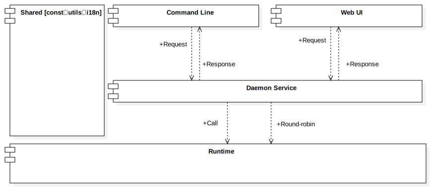

<pre>
    ____  __  _______
   / __ \/  |/  / __ )
  / /_/ / /|_/ / __  |
 / ____/ /  / / /_/ /
/_/   /_/  /_/_____/
</pre>

# P(rocess) M(anager) for B(un)


[简体中文](README_zh.md) | English

## install bun

```bash
curl -fsSL https://bun.sh/install | bash
```

## install pm-bun

```bash
bun add -g pm-bun
```

## use pmb
```bash
pmb -h
pmb <command> -h
```

## Commands

- `ls` Show list of service started by pmb

```bash
pmb ls 
```

- `monit` Monitoring services started by pmb

```bash
pmb monit 
```

- `start` Start a service from the entry file

```bash
# pmb start <entry-file-path> [-n name] [-s starter] [-a args]
pmb start path/app.ts
pmb start path/bun-app.ts -n app 
# using [bun] by default, equivalent to [-s bun]

pmb start path/bun-app.ts -n bun-app -s bun -a "--mode production"
pmb start path/node-app.js -n node-project -s node
pmb start path/deno-app.ts -n deno-project -s 'deno run -A'

```

- `stop` Stop a service from the pid or name

```bash
# pmb stop <name-or-pid>
pmb stop node-app
pmb stop 12345
```

- `restart` Restart a service from the name or pid

```bash
# pmb restart <name-or-pid> [-r]
pmb restart 12346
pmb restart bun-app
pmb restart bun-app -r   # reset the restRestartCount to the initial value
pmb restart 12346 -r 50  # reset the restRestartCount to 50
```

- `rm` Stop and remove a service from the pid or name

```bash
# pmb rm <name-or-pid>
pmb rm deno-app
pmb rm 12347
```

- `log` Show log of service from the pid or name

```bash
# pmb log [name-or-pid]
pmb log           # Show log of daemon
pmb log node-app  # Show log with the name of node-app
pmb log 12345     # Show log with the pid of 12345 
```

- `daemon` Manage daemon process

```bash
# pmb daemon <status | start | stop | restart>
pmb daemon status
pmb daemon start
pmb daemon stop
pmb daemon restart
```

- `ui` Show list of service started by pmb in browser

```bash
# pmb ui [-e] [-d]
pmb ui     # Show list of service started by pmb in browser
pmb ui -e  # enabled Web UI
pmb ui -d  # disabled Web UI
```

- `lang` Switch display language between Chinese and English

```bash
pmb lang
```

## Component Architecture Diagram


